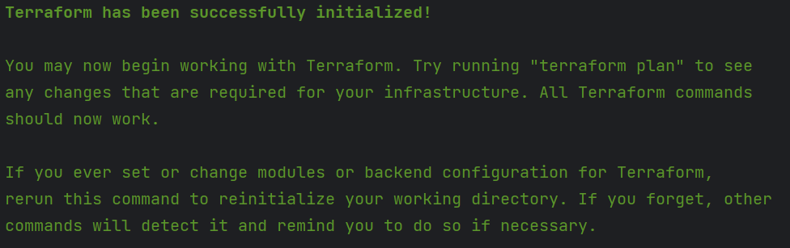
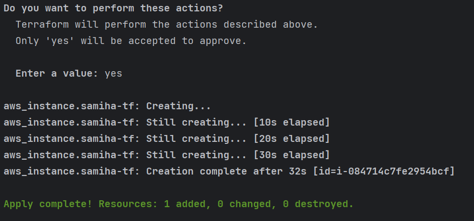
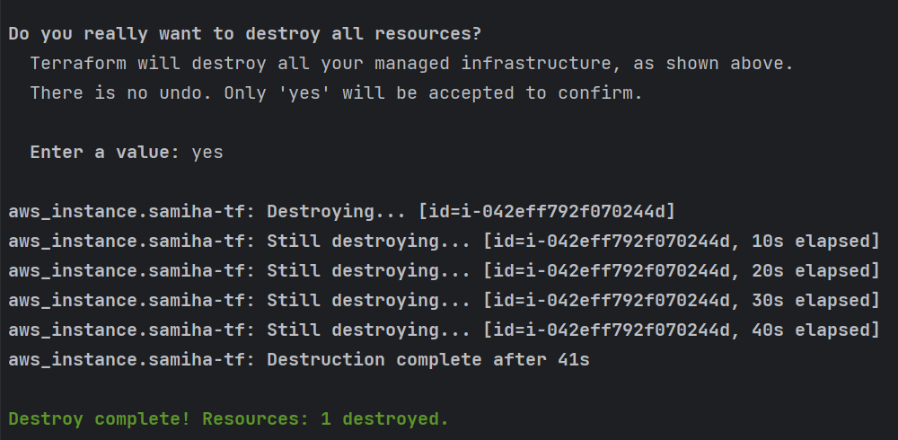

### Terraform

### Using Terraform to launch an EC2 Instance

### Prerequisites:

1. Install Terraform:
- Download and install Terraform from the official website.
- Add the Terraform binary to your system's PATH.

2. AWS Account:
- Set up your AWS console
- Create an environment variable in windows. Use the link for a guide: https://kb.wisc.edu/cae/page.php?id=24500

### Steps to use Terraform with AWS

**Step 1:** Initialise a Terraform project
- Create a new directory <br>
`tf-project`
- Inside the directory create a terraform file <br>
`main.tf`

**Step 2:** Configure AWS Provider
- in the main.tf file, configure the AWS provider with your AWS credentials, then Save. 

```
## Who is the cloud provider
provider "aws" {


# location of aws
  region = "eu-west-1"
}

# to download required dependencies
# create a service/resource on the cloud - ec2 on aws

resource "aws_instance" "samiha-tf" {
   ami = "ami-0905a3c97561e0b69"
   instance_type = "t2.micro"
   tags = {
     Name = "samiha-tf"
   }

}
```

**Step 3:** Initialise Terraform 

`terraform init`

**Expected output** 



**Step 4:** Plan your Infrastructure <br>

`terraform plan`

**Step 5:** Apply changes <br>

`terraform apply`

**Expected output** 



**If you navigate to AWS EC2, you will see that an EC2 instance has been created.** 


**Step 6:** Delete resources created <br>

`terraform destroy`, then confirm 'destroy'. This will delete the EC2 instance that was created. 

**Expected output**



### Using Terraform to create a GitHub Repository

### Prerequisites:

1. Install Terraform:
- Download and install Terraform from the official website.
- Add the Terraform binary to your system's PATH.

2. AWS Account:
- Set up your AWS console
- Create an environment variable in windows. Use the link for a guide: https://kb.wisc.edu/cae/page.php?id=24500

Step 1: 

### Using Terraform to create a S3 Buckets