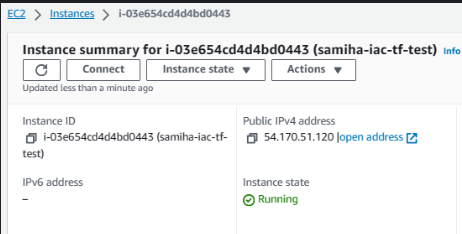
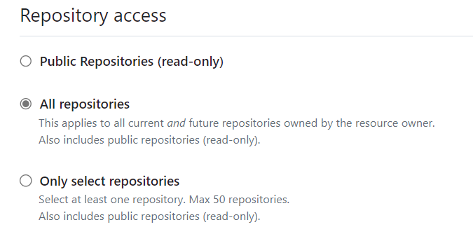

### What is Terraform?

Terraform is an open source tool that allows you to define and manage infrastructure as code.

Terraform simplifies previously manually completed tasks, by allowing you to write a script that describes the infrastructure you need using a straight forward readable language.

Once the script is written, using a few commands terraform will be able to create and configure resources for you across various cloud providers.

### Architecture


### Using Terraform to launch an EC2 Instance

### Prerequisites:

1. Install Terraform:
- Download and install Terraform from the official website.
- Add the Terraform binary to your system's PATH.

2. AWS Account:
- Set up your AWS console
- Create an environment variable in windows. Use the link for a guide: https://kb.wisc.edu/cae/page.php?id=24500

### Steps to use Terraform with AWS

**Step 1:** Initialise a Terraform project
- Create a new directory <br>
`tf-project`
- Inside the directory create a terraform file <br>
`main.tf`

**Step 2:** Configure AWS Provider
- in the main.tf file, configure the AWS provider with your AWS credentials, then Save. 

```
## Who is the cloud provider
provider "aws" {


# location of aws
  region = "eu-west-1"
}

# to download required dependencies
# create a service/resource on the cloud - ec2 on aws

resource "aws_instance" "samiha-tf" {
   ami = "ami-0905a3c97561e0b69"
   instance_type = "t2.micro"
   tags = {
     Name = "samiha-tf"
   }

}
```

**Step 3:** Initialise Terraform 

`terraform init`

**Expected output** 


**Step 4:** Plan your Infrastructure <br>

`terraform plan`

**Step 5:** Apply changes <br>

`terraform apply`

**Expected output** 


**If you navigate to AWS EC2, you will see that an EC2 instance has been created.** 



**Step 6:** Delete resources created <br>

`terraform destroy`, then confirm 'destroy'. This will delete the EC2 instance that was created. 

**Expected output**


### Using Terraform to create a GitHub Repository

### Prerequisites:

1. Install Terraform:
- Download and install Terraform from the official website.
- Add the Terraform binary to your system's PATH.

2. AWS Account:
- Set up your AWS console
- Create an environment variable in windows. Use the link for a guide: https://kb.wisc.edu/cae/page.php?id=24500

**Step 1:** Generate API token on GitHub

- Navigate to `settings`
- Select `Developer settings`
- Then select `Personal access tokens`
- Select `Fine-grained tokens`
- Select `Generate new token`


**Step 2:** Name the token and give an expiration date


**Step 3:** select repository access as ‘All repositories’



**Step 4:** Select Repository permissions →Administration →Read and Write


**Step 5:** Then click on ‘Generate Token’

Your token is now ready to use. 


**Step 6:** Create a new folder `git-repo-tf`, inside this create a `github.tf` file.


**Step 7:** inside the github.tf write the code as below and insert the token that was created into the code.  

```
terraform {
  required_providers {
    github = {
      source  = "integrations/github"
      version = "~> 5.0"
    }
  }
}

# Configure the GitHub Provider and provide token details

provider "github" {
  token = "insert API token created here"
}

# repository details

resource "github_repository" "example" {
  name        = "example"
  description = "My awesome codebase"

  visibility = "public"
}

```

**Step 8:** Initialise Terraform 

`terraform init`

**Step 9:** Plan your Infrastructure <br>

`terraform plan`

Step 10: Apply changes <br>

`terraform apply`

**If you navigate to GitHub, you will see that a repository has been created.** 

**Expected output**


### Using Terraform to create a S3 Buckets

### Prerequisites:

1. Install Terraform:
- Download and install Terraform from the official website.
- Add the Terraform binary to your system's PATH.

2. AWS Account:
- Set up your AWS console
- Create an environment variable in windows. Use the link for a guide: https://kb.wisc.edu/cae/page.php?id=24500

**Step 1:** Create a new directory `s3-tf`

Inside the directory create two terraform files:<br>

`provider.tf` (this will specify the provider) `main.tf`(this will specify the resource to be created)


**Step 2:** Configure the provider.tf file 

Navigate to Terraform: https://registry.terraform.io/providers/hashicorp/aws/latest

Select `use provider`


Copy and paste the code provided but specify the region you would like to use. 

```
terraform {
  required_providers {
    aws = {
      source = "hashicorp/aws"
      version = "5.36.0"
    }
  }
}

provider "aws" {
  # Configuration options
  region="eu-west-1"
}
```
**Step 3:** Initialise Terraform in the terminal 

`Terraform init`

**Step 4:** Configure the main.tf file using the code:

```
resource "aws_s3_bucket" "example" {
  bucket = "samiha195634"

  tags = {
    Name        = "samiha bucket"
    Environment = "Dev"
  }
}
```

**Step 5:** Plan your Infrastructure <br>

`terraform plan`

**Step 6:** Apply changes <br>

`terraform apply`

**If you navigate to AWS S3, you will see that a bucket has been created.** 

**Expected output**


**Delete resources created <br>**

`terraform destroy`, then confirm 'destroy'. This will delete the S3 bucket that was created. 


